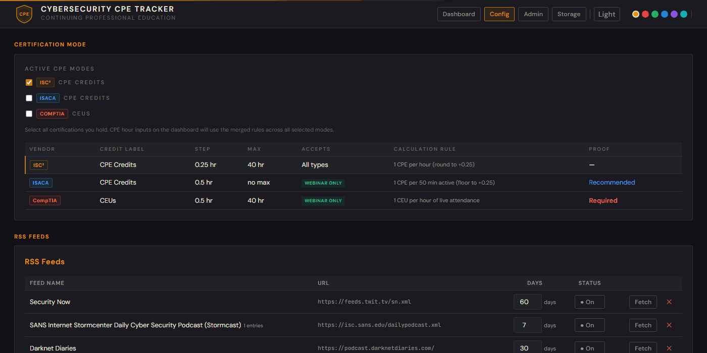
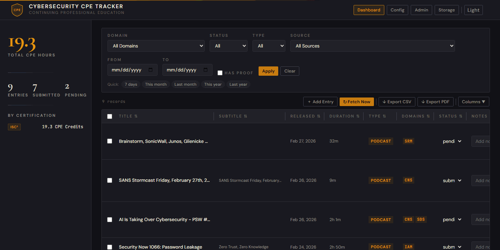
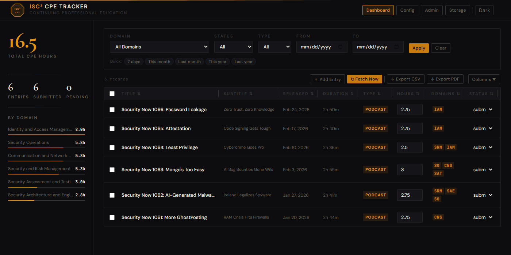
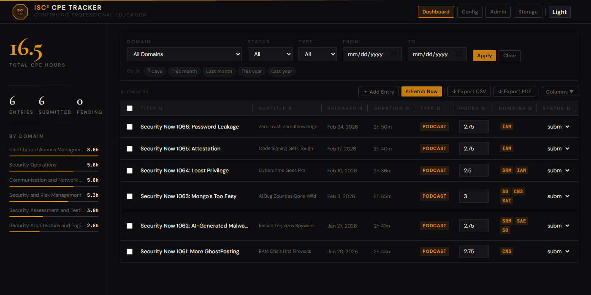
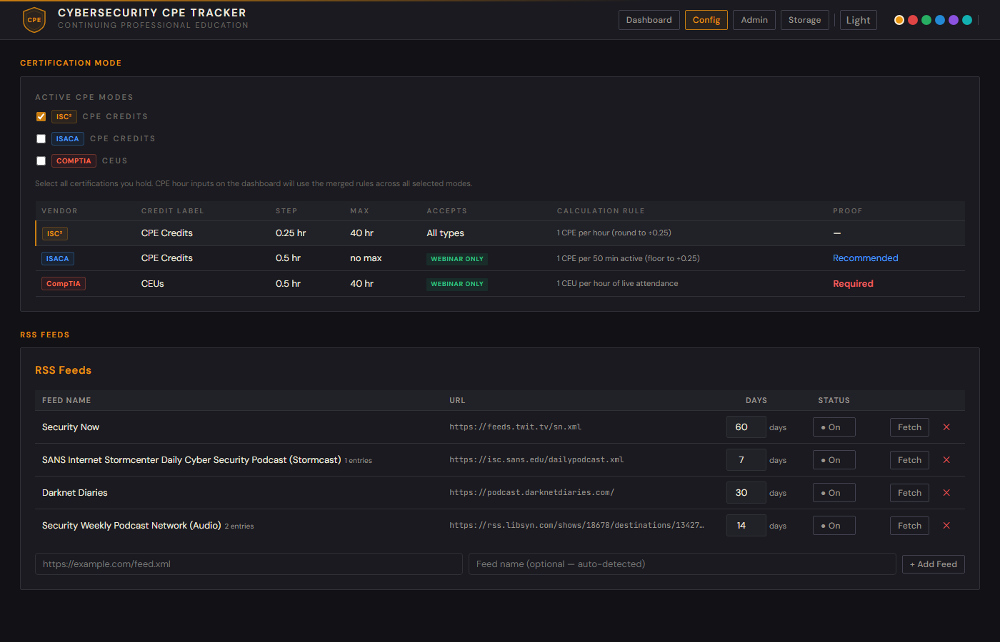
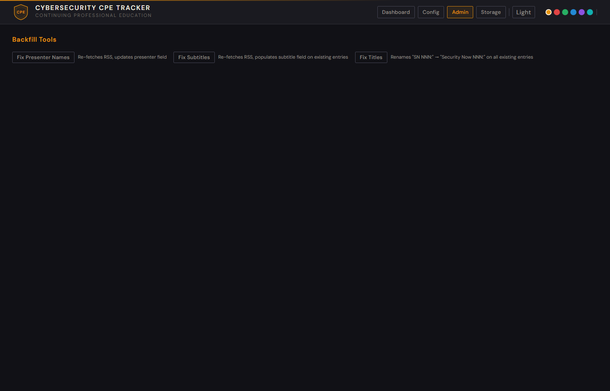

# Cybersecurity CPE Tracker

A self-hosted, Dockerized web app for tracking Continuing Professional Education (CPE) hours from security podcasts and other sources. Automatically pulls episodes from configurable RSS feeds and logs them as CPE entries. Review, edit, filter, and export records from a clean web UI — draft submission summaries, attach proof screenshots, and generate formatted PDF reports without leaving the app.

Supports **3 major cybersecurity certification vendors** out of the box — CPE hours are calculated according to each vendor's stated calculation instructions:

| Vendor | Certifications | CPE Calculation |
|--------|---------------|-----------------|
| **ISC²** | CISSP, CCSP, SSCP | 1 CPE per hour · 0.25 increments · max 40 per activity |
| **ISACA** | CISM, CRISC, CISA, CGEIT | 1 CPE per hour · webinar type required |
| **CompTIA** | Security+, CySA+, CASP+ | 1 CPE per hour · webinar type required |

> **Default feed:** Security Now (`feeds.twit.tv/sn.xml`) is pre-configured. Add any RSS/Atom podcast feed from the Config page. Manual entries can be added for any CPE source — courses, articles, conferences, webinars, etc.

   

---

## Screenshots

### Dashboard — dark mode (default)


### Vendor CPE mode — switch between certification views


### Column drag-to-reorder


### Light / Dark mode toggle


### Date preset chips


### Config — feed manager with per-feed sync window


### Storage — proof attachments


### Admin — backfill tools


---

## Features

### Certification Vendor Support
- **Multi-vendor CPE mode** — switch between ISC², ISACA, and CompTIA certification views from the sidebar; per-vendor credit columns appear automatically for the active vendors
- **Per-vendor credit columns** — draggable, reorderable, and hideable columns showing credit hours for each active vendor; freely positioned alongside standard columns
- **Per-vendor calculation rules** — each vendor's CPE rules are applied automatically; configurable on the Config page
- **Webinar entry type** — ISACA and CompTIA entries are restricted to the Webinar type in line with their CPE policies

### Data Ingestion
- **Multi-feed RSS** — configure any number of RSS/Atom podcast feeds from the Config page; each feed can be enabled or disabled independently; Security Now is pre-configured by default
- **Per-feed sync window** — each feed has its own configurable lookback window (1–365 days, default 60); change it on the Config page per feed
- **Auto-fetch** — pulls all enabled feeds every 6 hours; deduplicates by URL
- **Manual entry** — add CPE records for courses, articles, or any other source
- **Duration-based CPE hours** — parses `itunes:duration` from RSS; rounds to nearest 0.25 h; minimum 0.25, maximum 40 per activity
- **Short-entry detection** — entries under 15 minutes are flagged ⚠ in the Duration column; they show 0 individual CPE since vendors require a 15-minute minimum per submission
- **Multi-domain auto-tagging** — scores each episode against all 8 security domains; tags up to 3 matching domains automatically

### CPE Workflow
- **Submission modal** — per-entry panel with Title, Presenter, Year, CPE Credits, and a Summary textarea; summary pre-fills from the feed description as a starting point to edit
- **Submitted date tracking** — when an entry's status is set to "Submitted", the exact timestamp is automatically recorded; shown in PDF reports
- **Proof screenshots** — attach a PNG/JPEG/WEBP/GIF screenshot to any entry as submission evidence
- **PDF export** — generate a formatted, print-ready PDF report: cover page with total CPE hours and activity count, one page per entry with full metadata, domain tags, summary, notes, proof screenshot, and submission date stamp
- **Short-entry bundling in PDF** — all entries under 15 minutes are automatically grouped on a dedicated *Bundled Short Activities* page; their durations are summed and CPE hours calculated using the standard rounding rule (nearest 0.25 h, min 0.25, max 40); the sidebar total and cover page total both include the bundled CPE

> **Short-entry CPE guidance:** Certification vendors (ISC², ISACA, CompTIA) require a minimum of **15 minutes (0.25 CPE)** per submitted activity. Episodes shorter than 15 minutes cannot be submitted individually — they must be combined with other short activities. The app handles this automatically: short entries show `0` individual CPE in the dashboard and are bundled together in the PDF export with the correct combined calculation. Always retain documentation (certificates, emails, browser history) as proof in case of an audit.

### Table & Filtering
- **Inline editing** — edit CPE hours, domain, status, and notes directly in the table
- **Duration column** — episode runtime displayed as "1h 32m" from raw RSS duration data
- **Date preset chips** — one-click quick filters: 7 days, This month, Last month, This year, Last year
- **Filtering** — filter by domain, status (All / Pending / Submitted / Archived / Trash), type, and date range; sidebar counters reflect the current filtered view
- **Filtered sidebar** — Total CPE Hours, entry counts, and domain bars all update instantly to reflect the active filter
- **Column management** — drag-to-reorder columns in the picker dropdown, resize by dragging column edges, show/hide any column; all preferences persist in `localStorage`
- **Column sort** — click any header to sort ascending / descending
- **Multi-select + bulk actions** — checkbox column with select-all; floating bulk bar to set Status / Domain / Hours across many rows, or delete/restore/purge in bulk

### Trash & Recovery
- **Soft delete** — deleted entries are kept in the CSV so Fetch Now never re-adds them; URL stays in the deduplication set
- **Trash view** — select "Trash" in the Status filter to see deleted entries; restore to Pending or purge permanently
- **Purge** — permanently removes the row and its proof image

### UI & Theme
- **Light / Dark mode** — toggle between a warm light theme and the default dark theme; preference persists across page reloads and all pages; dark mode backgrounds tuned for comfortable contrast
- **Accent color picker** — 6 themes (amber, red, green, blue, purple, cyan); available on Config, Admin, and Storage pages
- **Amber/serif aesthetic** — Cormorant Garamond display numerals, DM Sans UI text, JetBrains Mono for data
- **Filtered sidebar** — total CPE hours (large serif), entry counts, domain progress bars; reflects current filter state
- **Mobile-responsive** — on narrow screens only Title and Proof columns are shown; PDF export is always accessible
- **No build step** — plain HTML/CSS/JS frontend; no Node.js or bundler

### Pages
| Page | Path | Purpose |
|------|------|---------|
| Dashboard | `/` | Main CPE table — filter, edit, export, fetch |
| Config | `/config.html` | Feed manager, per-feed sync window, vendor CPE rules |
| Admin | `/admin.html` | Backfill tools (fix presenter names, subtitles, titles) |
| Storage | `/storage.html` | Proof attachment listing and deletion |

---

## Quick Start

**Requirements:** Docker and Docker Compose

```bash
git clone https://github.com/alkajazz/cybersecurity-cpe-tracker.git
cd cybersecurity-cpe-tracker/cissp-cpe-tracker
docker compose up --build
```

Open **http://localhost:8081** in your browser.

On first start the app fetches the Security Now back-catalog (~10 seconds after startup). Click **Fetch Now** to trigger a manual pull at any time.

---

## Configuration

| Variable | Default | Description |
|----------|---------|-------------|
| `CSV_PATH` | `/app/data/cpes.csv` | Path to the CPE data file |

Data lives in `cissp-cpe-tracker/data/cpes.csv` and `data/attachments/`, mounted as a Docker volume — gitignored, never committed.

---

## API

| Method | Path | Description |
|--------|------|-------------|
| GET | `/api/cpes` | List CPEs (filter: `domain`, `status`, `type`, `date_from`, `date_to`) |
| POST | `/api/cpes` | Add a CPE entry manually |
| PUT | `/api/cpes/{id}` | Update a CPE entry |
| DELETE | `/api/cpes/{id}` | Soft-delete (moves to Trash) |
| DELETE | `/api/cpes/{id}/purge` | Permanently delete entry and proof image |
| POST | `/api/cpes/{id}/proof` | Upload a proof screenshot |
| GET | `/api/cpes/{id}/proof` | Serve a proof screenshot |
| DELETE | `/api/cpes/{id}/proof` | Delete a proof screenshot |
| POST | `/api/fetch` | Trigger an immediate RSS fetch (all enabled feeds) |
| GET | `/api/export` | Download the CSV |
| GET | `/api/summary` | CPE totals by domain, status, and type |
| GET | `/api/feeds` | List configured RSS feeds |
| POST | `/api/feeds` | Add a feed (validates URL, auto-detects name) |
| PUT | `/api/feeds/{id}` | Update feed name or enabled flag |
| DELETE | `/api/feeds/{id}` | Remove feed; `?purge_data=true` also deletes its CPE entries |
| GET | `/api/admin/storage` | List attachments with sizes and linked titles |
| POST | `/api/admin/backfill-presenters` | Re-sync presenter fields from RSS |
| POST | `/api/admin/backfill-subtitles` | Populate subtitle field on existing entries |
| POST | `/api/admin/backfill-titles` | Normalise title format on all entries |

Interactive docs: **http://localhost:8081/docs**

---

## Project Structure

```
cissp-cpe-tracker/
├── main.py              # FastAPI app and all API routes
├── rss.py               # RSS fetching, duration parsing, domain classification
├── storage.py           # Thread-safe CSV read/write (RLock + atomic writes)
├── feed_store.py        # Thread-safe JSON feed config store (feeds.json)
├── scheduler.py         # Background fetch job (every 6 hours)
├── requirements.txt
├── Dockerfile
├── docker-compose.yml
├── data/                # Docker volume mount (gitignored)
│   ├── cpes.csv         # All CPE records
│   ├── feeds.json       # Configured RSS feed list (auto-created)
│   └── attachments/     # Proof screenshot files
├── static/
│   ├── index.html       # Main dashboard
│   ├── admin.html       # Admin page (backfill tools)
│   ├── config.html      # Config page (feeds, vendor CPE rules)
│   ├── storage.html     # Storage page (proof attachments)
│   ├── app.js           # SPA logic
│   └── style.css
└── tests/
    ├── test_feeds.py    # Feed store CRUD (18 tests)
    ├── test_rss.py      # RSS parsing and domain classification (50 tests)
    └── test_storage.py  # CSV storage, soft delete, purge, submitted_date (35 tests)
```

---

## Changelog

See [CHANGELOG.md](CHANGELOG.md).
