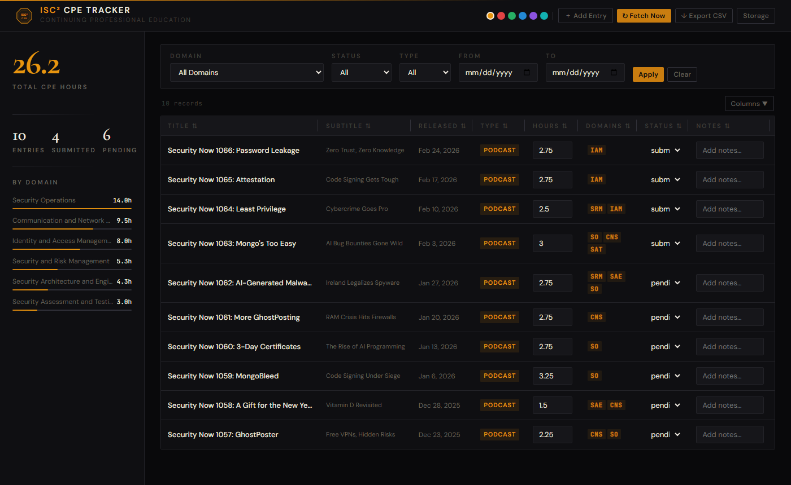

# ISC² CPE Tracker

A self-hosted, Dockerized web app for tracking ISC² Continuing Professional Education (CPE) hours from the **Security Now** podcast. Automatically pulls Security Now episodes from RSS and logs them as CPE entries. Review, edit, filter, and export records from a clean web UI — draft ISC² submission summaries, attach proof screenshots, and generate formatted PDF reports without leaving the app.

> **Note:** Automatic RSS ingestion supports **Security Now only** (`feeds.twit.tv/sn.xml`). Manual entries can be added for any CPE source (courses, articles, conferences, etc.).

   

---

## Screenshot



---

## Features

### Data Ingestion
- **Auto-fetch** — pulls Security Now episodes from RSS every 6 hours; deduplicates by URL
- **Manual entry** — add CPE records for courses, articles, or any other source
- **Duration-based CPE hours** — parses `itunes:duration` from RSS; rounds to nearest 0.25 h (ISC² rule); minimum 0.25, maximum 40 per activity
- **Multi-domain auto-tagging** — scores each episode against all 8 CISSP domains; tags up to 3 matching domains automatically

### ISC² Workflow
- **ISC² submission modal** — per-entry panel with Title, Presenter, Year, CPE Credits, and a Summary textarea; summary pre-fills from the feed description as a starting point to edit
- **Submitted date tracking** — when an entry's status is set to "Submitted", the exact timestamp is automatically recorded; shown in PDF reports
- **Proof screenshots** — attach a PNG/JPEG/WEBP/GIF screenshot to any entry as submission evidence
- **PDF export** — generate a formatted, print-ready PDF report: cover page with total CPE hours and activity count, one page per entry with full ISC² metadata, domain tags, summary, notes, proof screenshot, and submission date stamp

### Table & Filtering
- **Inline editing** — edit CPE hours, domain, status, and notes directly in the table
- **Duration column** — episode runtime displayed as "1h 32m" from raw RSS duration data
- **Filtering** — filter by domain, status (Pending / Submitted / Archived / Trash), type, and date range; defaults to Pending on load
- **Column management** — reorder (drag), resize (drag edge), show/hide columns; all preferences persist in `localStorage`
- **Column sort** — click any header to sort ascending / descending
- **Multi-select + bulk actions** — checkbox column with select-all; floating bulk bar to set Status / Domain / Hours across many rows, or delete/restore/purge in bulk

### Trash & Recovery
- **Soft delete** — deleted entries are kept in the CSV so Fetch Now never re-adds them; URL stays in the deduplication set
- **Trash view** — select "Trash" in the Status filter to see deleted entries; restore to Pending or purge permanently
- **Purge** — permanently removes the row and its proof image

### UI & Mobile
- **Amber/serif aesthetic** — near-black background, Cormorant Garamond display numerals, DM Sans UI text, JetBrains Mono for data
- **Accent color picker** — 6 themes (amber, red, green, blue, purple, cyan); persists in `localStorage`
- **Fixed sidebar** — total CPE hours (large serif), entry counts, domain progress bars
- **Mobile-responsive** — on narrow screens only Title and Proof columns are shown; PDF export button is always visible in the header (no row selection required on mobile)
- **No build step** — plain HTML/CSS/JS frontend; no Node.js or bundler

### Admin
- **Storage admin page** — `/admin.html`; lists attachments with sizes and linked entry titles
- **Backfill tools** — re-sync presenter names, subtitles, and title normalisation from RSS for existing entries

---

## Quick Start

**Requirements:** Docker and Docker Compose

```bash
git clone https://github.com/alkajazz/isc2-cpe-tracker.git
cd isc2-cpe-tracker/cissp-cpe-tracker
docker compose up --build
```

Open **http://localhost:8081** in your browser.

On first start the app fetches the Security Now back-catalog (~10 seconds after startup). Click **Fetch Now** to trigger a manual pull at any time.

---

## CPE Credit Rules

The app enforces ISC²'s published CPE credit rules:

- **1 CPE credit per hour** of qualifying activity
- **Increments of 0.25** — credits are rounded to the nearest quarter-hour
- **Maximum 40 CPE credits** per single activity
- Normal on-the-job activities where income is earned do not qualify

---

## CISSP Domains

CPE entries can be assigned to any of the 8 official ISC² CISSP domains:

1. Security and Risk Management
2. Asset Security
3. Security Architecture and Engineering
4. Communication and Network Security
5. Identity and Access Management
6. Security Assessment and Testing
7. Security Operations
8. Software Development Security

---

## Configuration

| Variable | Default | Description |
|----------|---------|-------------|
| `CSV_PATH` | `/app/data/cpes.csv` | Path to the CPE data file |

Data lives in `cissp-cpe-tracker/data/cpes.csv` and `data/attachments/`, mounted as a Docker volume — gitignored, never committed.

---

## API

| Method | Path | Description |
|--------|------|-------------|
| GET | `/api/cpes` | List CPEs (filter: `domain`, `status`, `type`, `date_from`, `date_to`) |
| POST | `/api/cpes` | Add a CPE entry manually |
| PUT | `/api/cpes/{id}` | Update a CPE entry |
| DELETE | `/api/cpes/{id}` | Soft-delete (moves to Trash) |
| DELETE | `/api/cpes/{id}/purge` | Permanently delete entry and proof image |
| POST | `/api/cpes/{id}/proof` | Upload a proof screenshot |
| GET | `/api/cpes/{id}/proof` | Serve a proof screenshot |
| DELETE | `/api/cpes/{id}/proof` | Delete a proof screenshot |
| POST | `/api/fetch` | Trigger an immediate RSS fetch |
| GET | `/api/export` | Download the CSV |
| GET | `/api/summary` | CPE totals by domain, status, and type |
| GET | `/api/admin/storage` | List attachments with sizes and linked titles |
| POST | `/api/admin/backfill-presenters` | Re-sync presenter fields from RSS |
| POST | `/api/admin/backfill-subtitles` | Populate subtitle field on existing entries |
| POST | `/api/admin/backfill-titles` | Normalise title format on all entries |

Interactive docs: **http://localhost:8081/docs**

---

## Project Structure

```
cissp-cpe-tracker/
├── main.py              # FastAPI app and all API routes
├── rss.py               # RSS fetching, duration parsing, domain classification
├── storage.py           # Thread-safe CSV read/write (RLock + atomic writes)
├── scheduler.py         # Background fetch job (every 6 hours)
├── requirements.txt
├── Dockerfile
├── docker-compose.yml
├── data/                # Docker volume mount (gitignored)
│   ├── cpes.csv         # All CPE records (CSV schema v1.6)
│   └── attachments/     # Proof screenshot files
├── static/
│   ├── index.html       # Main dashboard
│   ├── admin.html       # Storage admin page
│   ├── app.js           # SPA logic
│   └── style.css
└── tests/
    ├── test_rss.py      # RSS parsing and domain classification (36 tests)
    └── test_storage.py  # CSV storage, soft delete, purge, submitted_date (25 tests)
```

---

## Changelog

See [CHANGELOG.md](CHANGELOG.md).
